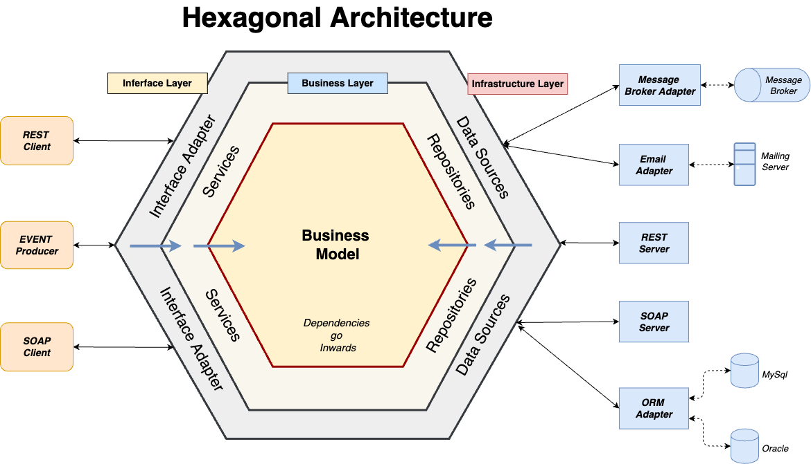

# Backend проект для умного бюджета

Добро пожаловать в наш проект! Этот проект реализован на основе гексагональной архитектуры с использованием фреймворка Spring для разработки Backend приложения на Java.

## Описание проекта
Наш проект разделен на различные слои в соответствии с принципами гексагональной архитектуры, тем самым обеспечивая высокую гибкость, расширяемость и тестируемость приложения.



## Используемые технологии
- Java
- Spring
- Spring Boot (JPA, Security, Web)
- Lombok
- PostgreSQL

## Локальный запуск
При локальном запуске необходимо определить следующие переменные окружения:
- `DATABASE_HOST` - хост базы данных
- `DATABASE_NAME` - наименование базы данных
- `DATABASE_USERNAME` - имя юзера для доступа к базе данных
- `DATABASE_PASSWORD` - пароль для доступа к базе данных
- `JWT_SECRET` - секретный JWT ключ
- `JWT_EXPIRATION_MS` - время жизни токена JWT
- `JWT_REFRESH_EXPIRATION_MS` - время жизни refresh токена JWT

## Эндпоинты

### Вход в аккаунт

#### URL

```curl
POST /api/v1/auth/signIn
```

#### Описание

Этот endpoint используется для входа в аккаунт пользователя

#### Параметры запроса
- `Тело запроса` - содержит информацию для входа в аккаунт

```json
{
    "username": "example_username",
    "password": "example_password"
}
```

#### Ответ

В качестве ответа придет JWT информация, включая токен доступа, рефреш токен, имя пользователя, его почта и роли

```json
{
    "token": "example_jwt_token",
    "type": "Bearer",
    "refreshToken": "example_refresh_token",
    "id": 1,
    "username": "example_username",
    "email": "example@example.com",
    "roles": [
        "ROLE_USER",
        "ROLE_ADMIN"
    ]
}
```

### Регистрация

#### URL

```curl
POST /api/v1/auth/signup
```

#### Описание

Этот endpoint используется для регистрации пользователя в системе

#### Параметры запроса
- `Тело запроса` - содержит информацию для регистрации пользователя в системе

```json
{
    "username": "example_username",
    "email": "example@example.com",
    "password": "example_password"
}
```

#### Ответ

В качестве ответа после успешной регистрации придет специально сообщение `User registered successfully!`

### Обновить токен доступа

#### URL

```curl
POST /api/v1/auth/refreshToken
```

#### Описание

Этот endpoint используется для обновления токена доступа на основе refresh токена

#### Параметры запроса
- `Тело запроса` - содержит информацию для регистрации пользователя в системе

```json
{
    "refreshToken": "example_refresh_token"
}
```

#### Ответ

В качестве ответа придет новый токен доступа

```json
{
    "accessToken": "example_access_token",
    "refreshToken": "example_refresh_token",
    "tokenType": "Bearer"
}
```
